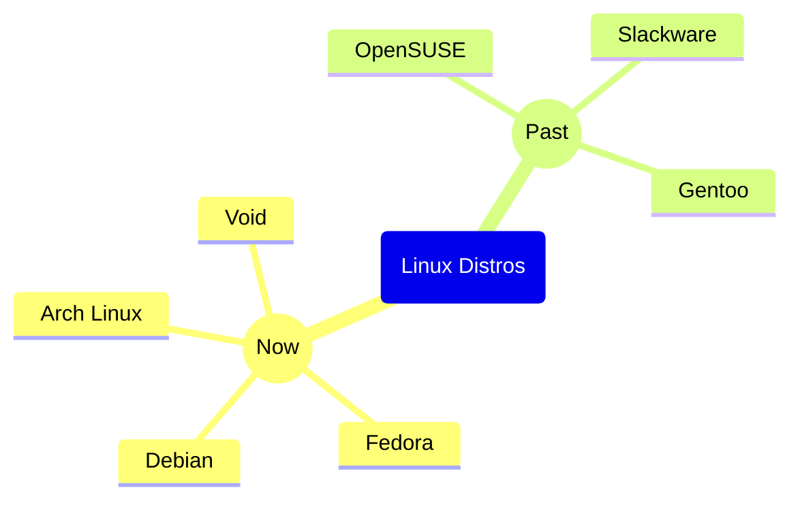
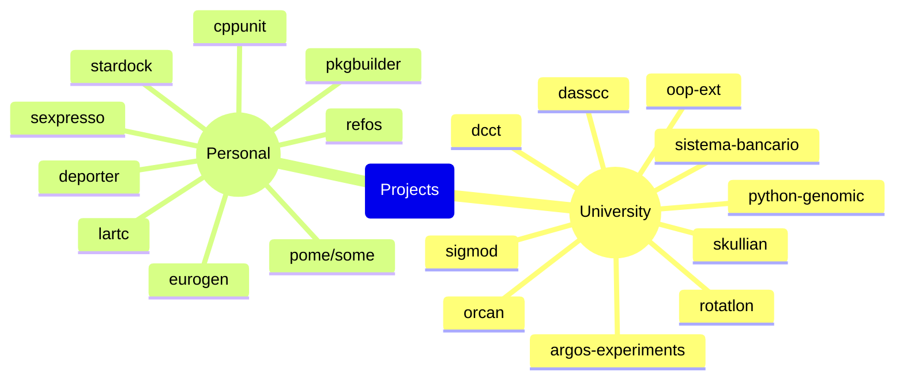

# frefolli 

I'm Refolli Francesco, 24, from Italy.

My second Github account is [windflaag](https://github.com/windflaag)

## Interests

## Education

### PhD Program in Computer Science

I'm currently enrolled in the 1st year of PhD Program in Computer Science at Universita' degli studi di Milano-Bicocca

### Master's Degree

I used to study Master's Degree in Computer Science at Universita' degli studi di Milano-Bicocca.

My thesis was "Unconventional reinforcement learning on traffic lights with SUMO"

I graduated with 110 out of 110 cum Laude

### Bachelor's Degree

I used to study Bachelor's Degree in Computer Science at Universita' degli studi di Milano-Bicocca.

My thesis was "A language-agnostic framework to build source code dependency graph"

I graduated with 107 out of 110

## Jobs

### Software Engineer

I used to work for Binary System SRL as Software Engineer.

Some notable contributions:

 - Deadline calculation
 - Backend imports
 - Frontend interfaces reimplementation

## My Future

Here are some funny things I would like to do in the future:

 - add java.util.Scanner.nextChar() method (kinda an old meme at this point)
 - rewrite the C++ world in Meson
 - drive locomotives/trains across Europe

# Skills 

## Programming Languages

## Linux Distros

## Text Editors

## Technologies

# Projects 

# Stats 

  <table width="100%">
    <tr><td></td></tr>
    <tr><td></td></tr>
    <tr><td></td></tr>
  </table>

